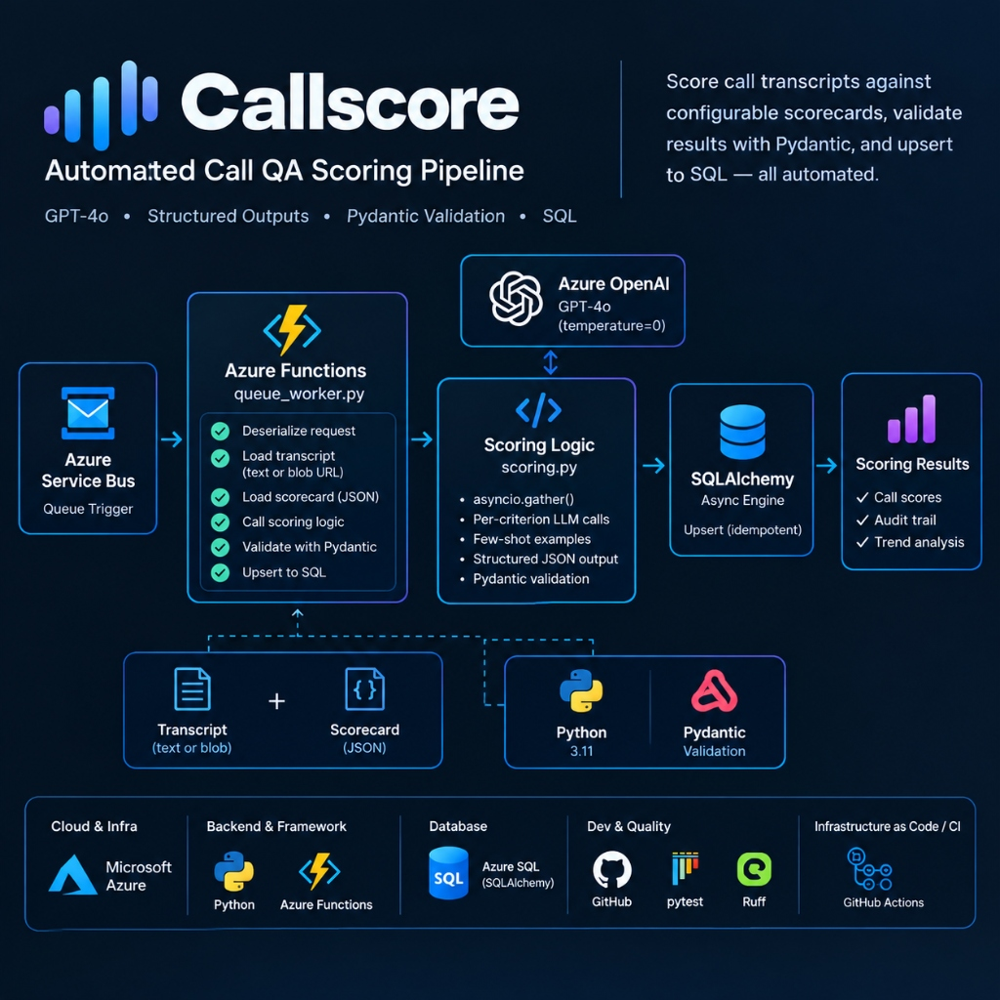

# Callscore

[](https://github.com/tariqkistan/Callscore/actions/workflows/ci.yml)
[](https://www.python.org/)
[](LICENSE)
[](https://github.com/tariqkistan/Callscore)

Automated call QA scoring pipeline using GPT-4o with structured outputs. Scores call transcripts against configurable scorecards, validates results with Pydantic, and upserts to SQL.

## Architecture



## Quickstart

```bash
# Install dependencies
pip install -e ".[dev]"

# Copy environment variables
cp .env.example .env
# Edit .env with your Azure OpenAI credentials

# Run unit tests (no API key required)
pytest tests/ -m "not eval"

# Run evaluation tests with real API
pytest tests/test_evals.py -m eval

# Run local pipeline with fixture
python scripts/run_local.py
```

## Test Commands

```bash
# Run all unit tests
pytest tests/ -m "not eval"

# Run with coverage
pytest tests/ -m "not eval" --cov=src/callscore --cov-report=html

# Run evaluation tests (requires real API key)
pytest tests/test_evals.py -m eval

# Lint
ruff check src/ tests/

# Typecheck
mypy src/ tests/
```

## Scorecard Format

Scorecards are JSON files in the `scorecards/` directory. Example structure:

```json
{
  "scorecard_id": "SC-DEBT-V1",
  "version": "1.0",
  "criteria": [
    {
      "id": "C01",
      "name": "greeting_compliance",
      "description": "Agent must greet customer and state purpose",
      "weight": 0.20,
      "scoring_type": "binary",
      "rubric": "1.0 if greeting present and purpose stated, 0.0 otherwise",
      "examples": [
        {
          "transcript_snippet": "Hello, this is John from XYZ Collections...",
          "score": 1.0,
          "reason": "Proper greeting and purpose stated"
        },
        {
          "transcript_snippet": "Hey, what's up?",
          "score": 0.0,
          "reason": "No greeting or purpose stated"
        }
      ]
    }
  ]
}
```

- `weight`: Must sum to 1.0 across all criteria
- `scoring_type`: "binary" (0.0 or 1.0) or "scale" (0.0 to 1.0)
- `examples`: 2+ few-shot examples for LLM guidance

## Status

- [x] Pydantic models with validation
- [x] Structlog JSON logging
- [x] GPT-4o scoring with structured outputs
- [x] Two-layer validation (Pydantic + business rules)
- [x] SQLAlchemy async upsert with idempotency
- [x] Azure Functions (HTTP trigger + Service Bus trigger)
- [x] Full pytest suite with fixtures
- [x] CI pipeline with lint, typecheck, tests, coverage

## Design Decisions

### Asyncio.gather for Concurrent Scoring
All criteria are scored concurrently using `asyncio.gather()` rather than sequentially. This reduces latency significantly for scorecards with many criteria. Each criterion has its own LLM call, so there's no dependency between them.

### Temperature=0
LLM calls use `temperature=0` for deterministic scoring. This minimizes variance between runs for the same transcript, which is critical for QA consistency.

### Two-Layer Validation
1. **Pydantic validation**: Ensures LLM output matches expected JSON structure and field types
2. **Business rule validation**: Validates scores are in range, rationales are non-empty, totals are correct, etc.

This separation allows schema errors to be caught early while business rules can evolve independently.

### UPSERT Idempotency
The database schema has a UNIQUE constraint on `(call_id, scorecard_id, scorecard_version, criterion_id)`. The ingest logic uses INSERT OR REPLACE (or equivalent) to ensure that re-scoring the same call updates existing records rather than creating duplicates.

### Raw LLM Response Audit Trail
Each `CriterionScore` stores `raw_llm_response` as the exact string returned by the LLM. This provides an audit trail for debugging scoring discrepancies and understanding why the model scored a particular way.

### Scorecard Versioning
Scorecards include `scorecard_id` and `version` fields. This allows the same call to be scored against multiple scorecard versions over time, enabling trend analysis and A/B testing of scoring criteria.

## Development

The project uses Ruff for linting and MyPy for type checking. Configuration files:
- `ruff.toml` - Linting rules
- `mypy.ini` - Type checking configuration

All tests use pytest with asyncio support. Unit tests mock the LLM; evaluation tests (`-m eval`) use the real API when credentials are available.
